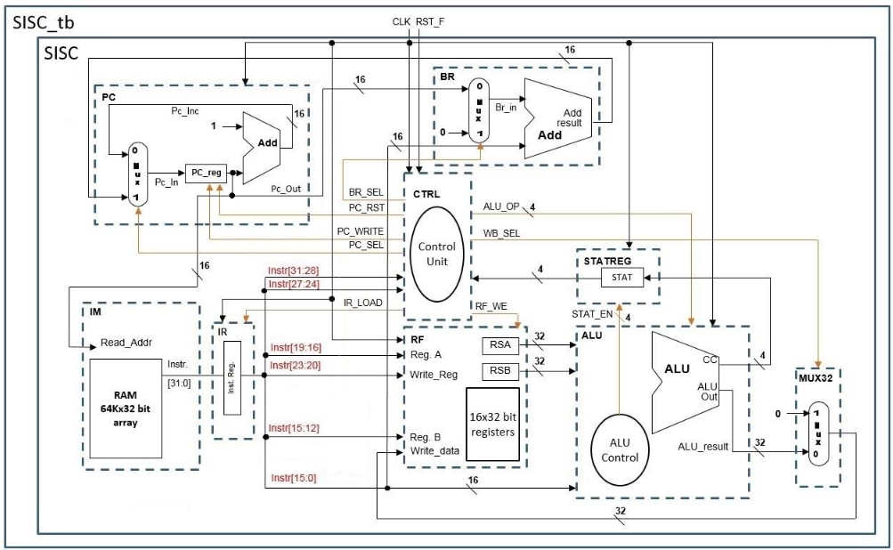

# Project Part 2: Simple Instruction Set Computer (SISC)

## Overview
This project was part of the ECE:3350 Computer Architecture and Organization course for Spring 2025. It involved implementing a Simple Instruction Set Computer (SISC) using Verilog HDL.

## Notes
- [Project 2 Notes (PDF)](../part_2/notes/part2.pdf)

## Block Diagram

## Created Files
- `imem.data`: Program used to test all instructions from Parts 1 and 2.
- `dm.v`, `im.v`, `mux32.v`, `rf.v`, `alu.v`, `statreg.v`, `br.v`, `pc.v`: Core modules (not modified).
- `ctrl.v`, `sisc.v`, `sisc_tb_p2.v`: Control unit, top-level SISC module, and testbench (completed).

## Tasks Completed
- Modified and completed `ctrl.v` and `sisc.v` to implement the SISC architecture and control logic for Part 2.
- Simulated the design using the provided `imem.data` to verify correct operation and instruction sequencing.
- Used `sisc_tb_p2.v` as the testbench for simulation and verification.

## Implementation Notes
- The control unit was updated to include signals for branching, program counter control, and instruction register loading.
- All modules were connected according to the block diagram, supporting program control flow and branching.

## Output
